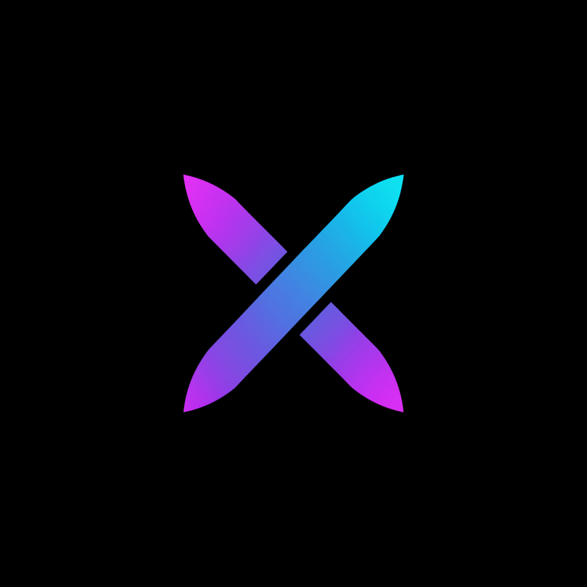

     
    

        
        <h1>Helium</h1>
    

    

        The Chromium-based web browser made for people, with love.
         
        Best privacy by default, unbiased ad-blocking, no bloat and no noise.
    

    
     

## Downloads
> [!NOTE]
> Xenon is in prototype stage, so unexpected issues may occur. We are not responsible
for any damage caused by usage of this software.

## Credits
### ungoogled-chromium
Xenon is proudly based on [ungoogled-chromium](https://github.com/ungoogled-software/ungoogled-chromium), and Helium.
Huge shout-out to everyone behind these amazing projects!

### The Chromium project
[The Chromium Project](https://www.chromium.org/) is obviously at the core of Helium,
making it possible to exist in the first place.

### ungoogled-chromium's dependencies
- [Inox patchset](https://github.com/gcarq/inox-patchset)
- [Debian](https://tracker.debian.org/pkg/chromium-browser)
- [Bromite](https://github.com/bromite/bromite)
- [Iridium Browser](https://iridiumbrowser.de/)

## License
All code, patches, modified portions of imported code or patches, and
any other content that is unique to Helium and not imported from other
repositories is licensed under GPL-3.0. See [LICENSE](LICENSE).

Any content imported from other projects retains its original license (for
example, any original unmodified code imported from ungoogled-chromium remains
licensed under their [BSD 3-Clause license](LICENSE.ungoogled_chromium)).

## More documentation (soon)
> [!NOTE]
> We will add more documentation along with design and motivation guidelines in the future.
All docs will be linked here along with other related content.
